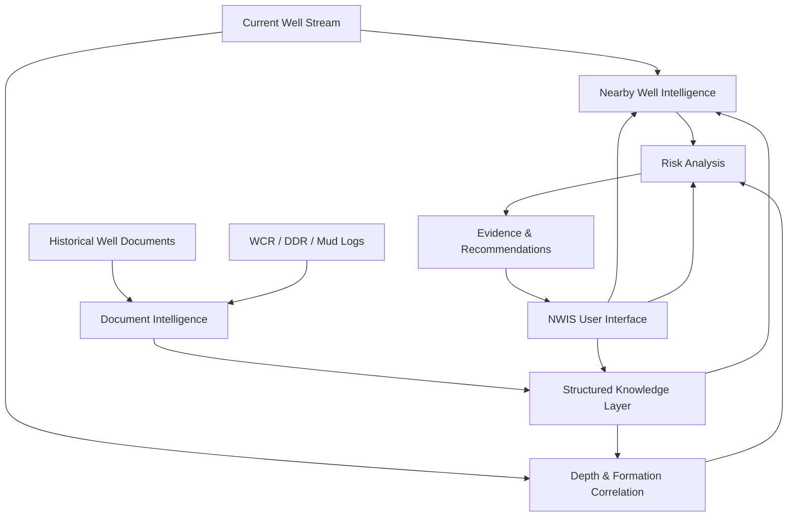

# NWIS — Nearby Wells Intelligence System

NWIS is an AI/ML-enabled decision-support prototype platform designed to provide nearby-well intelligence and institutional drilling memory alongside real-time drilling systems such as eRTMAC.

## 1. Problem Statement

Current drilling data is available through real-time systems, but historical drilling knowledge is fragmented across:
- Well Completion Reports (WCRs)
- Daily Drilling Reports (DDRs)
- Mud logging records
- Historical well data
- Geological and reservoir information
- Operational event records
- Institutional experience

This fragmentation creates delays in decision-making and limits proactive risk mitigation, as drillers must manually piece together historical context while managing active operations.

## 2. Solution

NWIS solves this by acting as an integrated decision-support layer:
**CURRENT WELL + NEARBY WELLS + HISTORICAL KNOWLEDGE + DEPTH/FORMATION CORRELATION + RISK ANALYSIS + EVIDENCE + RECOMMENDATIONS**

NWIS acts as an intelligence layer alongside existing real-time systems (like eRTMAC) rather than replacing them. It contextualizes current operations with historical data from offset wells to predict risks and provide actionable recommendations.

## 3. Key Capabilities

### Operational Overview
- Active well context
- Current depth
- Drilling parameters
- Risk intelligence
- Evidence chain

### Nearby Wells Intelligence
- Interactive map
- Configurable radius
- Nearby well selection
- Historical events

### Depth Correlation
- Current depth tracking
- Historical events mapped to depth
- Formation context
- Offset-well comparison

### Institutional Memory
- Historical events
- Geological memory
- Searchable drilling knowledge
- Mitigation and outcome records

### Risk Intelligence
- Risk contributors analysis
- Relevant depth windows
- Historical evidence
- Recommendations

### Document Intelligence
- PDF upload
- Document ingestion workflow
- Prototype OCR/NLP extraction
- Structured event records

### Alerts
- Risk alerts
- Operational anomalies
- Historical pattern warnings

### Reports
- Historical report records
- Report filtering
- Export capabilities

### Well Comparison
- Current vs offset well comparison

## 4. System Architecture



## 5. Application Architecture

```
nwis/
├── backend/
│   ├── data/            # Centralized synthetic data layer
│   ├── main.py          # FastAPI application entry point
│   ├── rag.py           # Retrieval-Augmented Generation workflows
│   ├── search.py        # Search and risk analysis services
│   ├── stream.py        # Telemetry stream simulation
│   └── requirements.txt # Python dependencies
└── frontend/
    ├── src/
    │   ├── components/  # React components for UI modules
    │   ├── services/    # API interaction services
    │   ├── App.jsx      # Main application shell
    │   ├── main.jsx     # Frontend entry point
    │   └── index.css    # Core styling
    ├── package.json     # Node dependencies
    └── vite.config.js   # Build configuration
```

## 6. Data Flow

1. Active well data enters NWIS via the streaming service.
2. Nearby wells are identified geographically.
3. Historical events are associated by well, depth, and formation.
4. Document intelligence structures uploaded historical records into knowledge.
5. Risk contributors are calculated dynamically based on current parameters and historical correlations.
6. Evidence is associated with the active risk.
7. Recommendations are presented to the user.
8. The engineer can inspect supporting evidence and export reports.

## 7. Technology Stack

- **Frontend:** React, Vite, JavaScript/JSX, Vanilla CSS
- **Visualizations & Mapping:** Leaflet, React-Leaflet, Recharts
- **Backend:** Python, FastAPI, Uvicorn

## 8. Prototype Data

**IMPORTANT:** The current prototype uses synthetic/demo drilling data because no production OIL dataset or eRTMAC API was provided for the development environment.

The synthetic dataset is designed to demonstrate:
- Nearby wells identification
- Historical events correlation
- Formation correlation
- Risk patterns
- Document intelligence
- Recommendations

A production deployment would connect to authorized OIL data sources rather than using this localized JSON/CSV data.

## 9. Setup

### Prerequisites
- Node.js (v18+)
- Python (v3.10+)

### Backend Setup
```bash
cd backend
pip install -r requirements.txt
uvicorn main:app --reload --port 8000
```

### Frontend Setup
```bash
cd frontend
npm install
npm run dev
```

## 10. Environment Variables

Currently, no environment variables are required to run the prototype. Future integrations with production systems will require `.env` files for database URIs, eRTMAC credentials, and LLM API keys.

## 11. User Workflow

1. **Select active well** to begin monitoring.
2. **Inspect current drilling state** and depth.
3. **View nearby wells** on the interactive map.
4. **Compare offset wells** to identify trends.
5. **Inspect historical events** occurring at similar depths.
6. **Search geological memory** for past mitigations.
7. **Review risk** and operational anomalies.
8. **Inspect evidence** behind the calculated risks.
9. **Upload historical PDF** to structure document information.
10. **Review structured document information** generated from the document intelligence module.
11. **Export relevant information** for reporting.

## 12. SIH Problem Statement Mapping

| Requirement | NWIS Implementation |
|---|---|
| Nearby wells | Interactive geospatial module (`Map`, `NearbyWells`) |
| Historical drilling knowledge | Institutional memory (`HistoricalEvents`) |
| Geological/depth correlation | Depth correlation (`DepthCorrelation`) |
| Risk prediction | Risk intelligence (`RiskAnalysis`, `RiskGauge`) |
| Proactive alerts | Alerts module (`AlertsCenter`, `AlertBanner`) |
| Recommendations | Evidence/recommendation workflow |
| OCR/NLP | Document intelligence prototype (`DocumentIntelligence`) |
| Searchable repository | Geological memory (`GeologicalMemory`) |
| User-friendly dashboard | Operational overview (`LiveMonitoring`, `IntelligencePanel`) |

## 13. Current Limitations

- **Synthetic Data:** Uses synthetic/demo data as mentioned above.
- **Prototype NLP/OCR:** The document processing pipeline currently simulates OCR/NLP workflows.
- **No Production Integration:** Does not currently connect to a live eRTMAC system.
- **No Production ML:** Risk models are heuristics-based for demonstration, not validated production ML.

## 14. Future Integration

To evolve this prototype into a production system, the following steps are planned:
- Authorized eRTMAC integration for live streaming telemetry
- WCR/DDR database ingestion pipelines
- Production OCR/NLP implementations for unstructured reports
- Vector/semantic search for geological memory
- Validated risk models trained on historical data
- Role-based access control (RBAC) and audit logging
- Enterprise deployment architecture
